# Cloudvelous: Agent OS

Cloudvelous AgentOS did not start as an autonomous engineering platform.

The original goal was much simpler: build an intelligent chatbot that could understand technical documentation and provide accurate, context aware answers. Early iterations focused heavily on retrieval quality, semantic understanding, and multi step reasoning, with the aim of making the assistant feel less like keyword search and more like a knowledgeable technical expert.

As the system evolved, the vision expanded beyond question answering. The objective became to create an agent capable of using tools and executing real tasks, not just returning information. The long term direction is for the agent to interact with external systems such as calendars, email, online research, and other operational tools, and to handle increasingly complex workflows.

A key design principle is that the agent should improve in a human like way. Rather than remaining static, it is designed to:

practise tasks through repeated execution

review and critique its own decisions

learn from feedback and outcomes

refine its strategies over time

This shift from passive chatbot to active, self improving agent ultimately led to the development of the autonomous coding and engineering capabilities that now form the core of Cloudvelous AgentOS.

**Product Feature Overview**

---

## Summary

Cloudvelous is an intelligent AI platform that combines two powerful capabilities:

1. **Smart Documentation Assistant** - An AI that answers questions about your technical documentation and gets smarter with every interaction
2. **Autonomous Software Engineer** - An AI agent that can plan, write, test, and review code with minimal human oversight

Think of it as having both a knowledgeable expert who can instantly answer any question about your systems, and a tireless development team that works 24/7 to implement features while learning from experience.

---

## The Core AI Assistant: Your Intelligent Knowledge Partner

### What It Does

The base AI assistant acts as an expert consultant for your documentation. Users ask questions in plain English, and the system provides accurate, sourced answers by understanding and searching through your entire knowledge base.

**Real-World Example:**
- **User asks:** "How do I configure Docker in this project?"
- **System responds:** Provides step-by-step instructions, cites specific documentation files, and explains the reasoning behind each step

### How It Works (Conceptually)

```mermaid
flowchart TB
    User[👤 User Asks Question] --> Understand[🧠 Understand Meaning<br/>Not just keywords]
    Understand --> Search[🔍 Search Documentation<br/>Find relevant sources]
    Search --> Validate[✓ Validate Quality<br/>Check if sources answer question]
    Validate --> Synthesise[📝 Synthesise Answer<br/>Combine information clearly]
    Synthesise --> Deliver[💬 Deliver Answer<br/>With source citations]
    
    Deliver --> Feedback{👍 Was it helpful?}
    Feedback -->|Yes| Learn[📚 Learn & Improve<br/>Remember what worked]
    Feedback -->|No| LearnNot[📉 Learn & Adjust<br/>Avoid similar approaches]
    
    Learn --> Better[🎯 Future Answers<br/>Get Better]
    LearnNot --> Better
    
    Better -.->|Next Question| User
    
    style User fill:#e3f2fd
    style Deliver fill:#c8e6c9
    style Learn fill:#fff9c4
    style Better fill:#f8bbd0
```

#### 1. **Semantic Understanding**

Instead of simple keyword matching, the AI understands meaning and context:

- When you ask about "setting up authentication," it knows this relates to "login," "user verification," and "security"
- It connects related concepts even when different words are used
- Questions are refined to be more precise before searching

**Why This Matters:** Users get relevant answers even when they don't use exact technical terms. The system understands intent, not just keywords.

#### 2. **Multi-Step Reasoning**

The AI doesn't just retrieve information—it thinks through problems:

- **Search:** Finds potentially relevant documentation
- **Validate:** Checks if sources actually answer the question
- **Refine:** Looks for additional context if needed
- **Cross-Check:** Verifies consistency across sources
- **Synthesise:** Combines information into a coherent answer

**Why This Matters:** You get thoughtful, comprehensive answers rather than raw document excerpts. The AI acts like a human expert who considers multiple sources before responding.

#### 3. **Curated Quick Answers**

For common questions, the system maintains a priority knowledge base:

- Frequently asked questions get instant responses
- No search delay for routine queries
- Ensures consistency for standard answers

**Why This Matters:** Your team gets immediate answers to common questions, improving productivity and reducing support burden.

#### 4. **Quality Self-Assessment**

Before delivering an answer, the AI evaluates its own work:

- **Confidence:** How certain is it about the answer?
- **Completeness:** Did it address all aspects of the question?
- **Source Quality:** How relevant were the documents used?
- **Consistency:** Do all sources agree?

**Why This Matters:** The system knows when it's uncertain and can request human review for borderline cases, preventing wrong information from being shared.

---

## Self-Learning: The AI That Gets Smarter Every Day

### How the System Learns

Unlike traditional software that stays static, Cloudvelous continuously improves through multiple learning mechanisms:

```mermaid
flowchart LR
    subgraph Day1[Week 1]
        Q1[Question] --> A1[70% Accurate<br/>Answer]
    end
    
    subgraph Learn[Learning Process]
        FB[Human Feedback<br/>✓ Helpful<br/>✗ Not Helpful]
        FB --> Memory[Remember<br/>Patterns]
        Memory --> Adjust[Adjust<br/>Knowledge]
    end
    
    subgraph Day2[Week 8]
        Q2[Same Question] --> A2[95% Accurate<br/>Answer]
    end
    
    A1 --> FB
    Adjust --> Q2
    
    style A1 fill:#ffcdd2
    style A2 fill:#c8e6c9
    style Learn fill:#fff9c4
```

**The Learning Cycle:**
1. System provides an answer
2. Human confirms if it was helpful
3. System remembers what worked (or didn't)
4. Future answers automatically improve
5. No manual programming needed

#### 1. **Contextual Pattern Learning**

When a human confirms an answer was helpful:

- The system remembers which documentation was useful for that type of question
- Future similar questions automatically prioritise those proven sources
- Learning is context-specific: what works for Docker questions stays with Docker, not contaminating billing topics

**Real-World Impact:**
- Week 1: "How do I deploy?" gets a 70% relevant answer
- Week 8: After feedback, the same question gets a 95% relevant answer
- The system learned from 20 real user interactions which documents matter most

#### 2. **Workflow Template Learning**

The AI creates reusable "playbooks" from successful interactions:

- When a multi-step reasoning chain produces a great answer, it's saved as a template
- Similar future questions automatically follow the proven workflow
- Templates include the thought process, not just the answer

**Analogy:** Like an apprentice watching an expert solve problems and creating checklists of effective approaches. Over time, the apprentice builds a library of proven methods.

#### 3. **Adaptive Weight Adjustment**

Each piece of documentation has a "relevance score" that adjusts based on feedback:

- Consistently useful documents: Score increases (more likely to be retrieved)
- Frequently irrelevant documents: Score decreases (less likely to appear)
- Gradual adjustment prevents over-correction from single feedback instances

**Why This Matters:** The system develops "intuition" about which sources to trust, similar to how experienced employees know where to find the best information.

#### 4. **Smart Sample Selection (Active Learning)**

The system identifies which questions need human review most urgently:

- High-uncertainty answers flagged for review
- Maximum learning value prioritised
- Not all answers need review—only the ones where feedback matters most

**Why This Matters:** Your team's review time is used efficiently, focusing on cases that improve the system most rather than reviewing every interaction.

#### 5. **Gap Detection**

The AI automatically identifies what it doesn't know:

- Recognises questions it can't answer well
- Suggests documentation that should be added
- Tracks common question patterns without good answers

**Why This Matters:** You get actionable insights about documentation gaps and knowledge needs without manual analysis.

---

## The Autonomous Engineering Agent: Your AI Development Team

### What It Does

The engineering agent is a complete AI development team that can take a feature requirement and autonomously plan, implement, test, review, and deploy code—all while coordinating multiple AI perspectives and involving humans only at critical decision points.

**Real-World Example:**
- **You specify:** "Add Stripe subscription module. Users can subscribe to monthly or annual plans. Handle payment webhooks."
- **System delivers:** Complete, tested code with proper architecture, error handling, and documentation—ready for your review

### How It Works (Conceptually)

#### 1. **Multi-Agent Council System**

Instead of relying on a single AI's judgment, the system uses multiple AI agents that work together:

- **Multiple Perspectives:** Different AI agents (Cursor, Codex, OpenCode) each provide their approach
- **Democratic Voting:** Agents vote on the best solution
- **Debate & Refinement:** When agents disagree, they argue their points and reach consensus
- **Best-of-Breed:** The final output combines the strengths of multiple AI minds

**Analogy:** Like having a team meeting where senior engineers each propose an approach, discuss trade-offs, and vote on the best path forward—except it happens in minutes instead of hours.

**Why This Matters:** You get more robust solutions because multiple AI perspectives catch issues that a single AI might miss. It's built-in peer review.

#### 2. **Intelligent Requirement Decomposition**

When you provide a large feature request, the system automatically breaks it down:

- **Complexity Detection:** Analyses requirements using multiple metrics (size, scope, dependencies)
- **Smart Breaking:** AI determines logical sub-features that can be built sequentially
- **Dependency Ordering:** Understands what must be built first (e.g., user model before payments)
- **Granular Execution:** Each sub-requirement goes through the full development cycle independently

**Real-World Example:**
- **You ask for:** "Build complete user management system"
- **System breaks into:**
  1. User authentication (login/logout)
  2. User profiles and settings
  3. Role-based permissions
  4. Account recovery workflows
  5. Admin user management panel

Each piece is built, tested, and reviewed separately, reducing risk and enabling parallel progress tracking.

**Why This Matters:** Large features don't get stuck in monolithic implementation. You see incremental progress, can provide feedback along the way, and reduce the risk of major rework.

#### 3. **Complete Development Lifecycle (SDLC)**

The agent follows professional software development stages:

##### **Stage 1: Planning**
- Multiple AI agents create detailed implementation plans
- Plans include architecture decisions, file structure, key functions, testing strategy
- Agents debate approaches and vote on the best plan
- Result: A comprehensive blueprint before any code is written

##### **Stage 2: Implementation**
- Code is written following the approved plan
- Work happens in an isolated workspace (your main code is never touched during development)
- Follows your coding standards automatically
- Agents coordinate on complex cross-file changes

##### **Stage 3: Testing (Test-Driven Development)**
- Tests written BEFORE implementation when possible
- Red → Green → Refactor cycle enforced
- Automated test execution
- Coverage requirements met

##### **Stage 4: Review**
- Multi-agent code review with specific criteria
- Each agent provides feedback on quality, security, maintainability
- Voting on whether code meets standards
- Multiple review cycles if needed (with limits to prevent endless loops)

##### **Stage 5: Deployment (Human-Gated)**
- Code is ready for your repository
- Waits for your approval before pushing
- Creates proper Git commits with descriptive messages
- Can create pull requests for team review

**Why This Matters:** You get professional-grade software development following industry best practices, not ad-hoc code generation. The process is transparent and controllable at every stage.

#### 4. **Human-in-the-Loop (HITL) Gates**

Critical decisions pause and wait for human approval:

- **When:** Git pushes, deploy operations, controversial design choices, unresolvable disagreements
- **How:** You receive an email with context and a simple approve/reject link
- **Flexibility:** Configure which operations require approval
- **Timeout Handling:** System knows what to do if you don't respond within a timeframe

**Why This Matters:** You maintain control over critical operations while automating routine work. The AI handles the 95% of work that's straightforward, escalating only the 5% that needs human judgment.

#### 5. **Continuous Learning & Improvement**

After each completed feature, the system analyses what happened:

- **What worked well:** Successful patterns are saved for reuse
- **What caused delays:** Bottlenecks are identified (e.g., consensus delays, recurring concerns)
- **Agent performance:** Tracks which agents provide better plans/code
- **Lesson application:** Future requirements benefit from accumulated experience

**Real-World Impact:**
- **Month 1:** Simple features take 3 planning iterations to reach consensus
- **Month 6:** Similar features reach consensus in 1 iteration because the system learned team preferences
- **Accumulated knowledge:** Library of proven architectural patterns for common features

---

## User Experience: How People Interact with the System

### For End Users (Documentation Questions)

**Public Chat Interface:**
- Clean, modern web interface
- Type questions in plain English
- Instant or near-instant answers
- See source documents that were used
- No login required
- Mobile-friendly

**What Makes It Great:**
- Feels like chatting with an expert colleague
- No need to search through documentation manually
- Answers cite sources for verification
- Available 24/7

### For Administrators (Training & Oversight)

**Admin Dashboard:**
- Live statistics on accuracy and usage
- Performance analytics by question type
- Identify trending topics and gaps
- Monitor system health

**Session Management:**
- Review question/answer history
- Search and filter past interactions
- Bulk operations for efficiency
- Export data for analysis

**Training Interface:**
- Quick review mode: Rapid thumbs-up/down feedback
- Detailed review: Specify which sources were useful
- Bulk review: Process multiple sessions efficiently
- Undo capability: Fix mistakes in feedback

**Dynamic Training:**
- Interactive conversation to improve answers
- Suggest better documentation sources
- Refine answer quality in real-time
- Gap detection and recommendations

**What Makes It Great:**
- Efficient workflows minimise time spent on reviews
- Keyboard shortcuts for power users
- Visible impact: See accuracy improve over time
- Actionable insights: Know what documentation to create or improve

### For Developers (Engineering Agent)

**Project Management:**
- Register projects with isolated workspaces
- Configure GitHub integration and permissions
- Set coding standards and conventions
- Define human-approval requirements

**Requirement Submission:**
- Write feature specs in plain English
- System handles decomposition automatically
- Track progress on complex features
- Monitor each sub-requirement independently

**Approval Workflow:**
- Email notifications for decisions
- Simple web interface to approve/reject
- View full context of what's being proposed
- Add comments and feedback

**Monitoring:**
- Real-time progress on active requirements
- Detailed logs of agent discussions and decisions
- Visual progress indicators
- Historical audit trail

**What Makes It Great:**
- Minimal daily involvement: mostly just approvals
- Transparent process: See how decisions are made
- Flexible control: Configure how much oversight you want
- Safe experimentation: Isolated workspaces prevent damage

---

## Key Differentiators: What Makes Cloudvelous Unique

### 1. **True Self-Learning**

Unlike static AI that requires retraining by engineers:
- Learns from every interaction automatically
- No developer intervention needed
- Improvements happen continuously
- Context-aware learning prevents cross-contamination

### 2. **Multi-AI Collaboration**

Instead of single AI limitations:
- Multiple AI agents provide different perspectives
- Democratic decision-making reduces bias
- Built-in peer review catches mistakes
- Combines strengths of different AI models

### 3. **Professional Development Standards**

Not just code generation:
- Complete SDLC with proper stages
- Test-driven development enforced
- Multi-pass code review
- Architectural consistency maintained

### 4. **Intelligent Decomposition**

Handles complexity automatically:
- Large features broken down intelligently
- Sequential execution with dependency awareness
- Incremental progress visibility
- Reduced risk through smaller changes

### 5. **Human Control Where It Matters**

Automation with safety:
- Critical decisions require approval
- Configurable autonomy levels
- Transparent decision-making process
- Override capabilities at any stage

### 6. **Continuous Improvement Culture**

Built for learning organisations:
- System gets smarter with use
- Accumulated organisational knowledge
- Identified gaps drive documentation improvements
- Metrics track progress over time

---

## Value Proposition: Why This Matters for Your Organisation

### Immediate Benefits

**For Documentation/Knowledge:**
- Reduce support ticket volume by 40-60% (common questions answered instantly)
- Onboard new employees faster with instant expert answers
- Free up senior staff from repetitive questions
- Ensure consistent answers across the organisation

**For Software Development:**
- Accelerate feature delivery by handling routine implementation
- Reduce developer time spent on boilerplate and repetitive code
- Maintain consistent coding standards automatically
- Free developers to focus on complex, creative problems

### Long-Term Strategic Value

**Knowledge Accumulation:**
- Build institutional knowledge that survives employee turnover
- Identify and fill documentation gaps systematically
- Create searchable history of decisions and solutions
- Develop proven patterns for common challenges

**Quality Improvement:**
- Accuracy improves continuously without intervention
- Multi-agent review catches more issues than single developers
- Automated testing ensures reliability
- Consistent adherence to best practices

**Scalability:**
- Handle growing question volume without adding support staff
- Implement features at consistent velocity regardless of team size
- Parallel processing of multiple requirements
- 24/7 availability without shift work

**Risk Reduction:**
- Isolated workspaces prevent accidental damage
- Multi-stage review before code reaches production
- Human approval gates for critical operations
- Comprehensive audit trail for compliance

---

## Real-World Usage Scenarios

### Scenario 1: Customer Support Team

**Before Cloudvelous:**
- Support agent gets customer question about API authentication
- Searches documentation for 5 minutes
- Finds 3 different docs with conflicting information
- Escalates to engineering team
- Customer waits 2 hours for answer

**With Cloudvelous:**
- Support agent asks AI: "How does API authentication work in our system?"
- Gets accurate answer in 3 seconds with source citations
- Provides customer with answer immediately
- No engineering team interruption needed

**Impact:** 2-hour resolution → 3-second resolution. Engineering team freed from interruptions.

### Scenario 2: New Developer Onboarding

**Before Cloudvelous:**
- New developer needs to understand deployment process
- Reads 10 different documents
- Still has questions, schedules meeting with senior developer
- Senior developer spends 45 minutes explaining
- Process repeated for each new hire

**With Cloudvelous:**
- New developer asks specific questions as they arise
- Gets instant, accurate answers with context
- Can ask follow-up questions naturally
- Senior developer available for strategic guidance only

**Impact:** 45 minutes of senior developer time per question → 0 minutes. Faster onboarding. Better questions when meetings do happen.

### Scenario 3: Feature Development

**Before Cloudvelous:**
- Product manager requests: "Add subscription billing"
- Engineering team spends 4 hours in planning meetings
- 2 weeks of developer time to implement
- Manual code review process (3 days)
- Testing and fixes (1 week)
- Total: 3.5 weeks calendar time

**With Cloudvelous:**
- Product manager submits requirement in plain English
- AI council creates comprehensive plan (30 minutes)
- Implementation with tests (automated, runs overnight)
- Multi-agent code review (1 hour)
- Developer approves final result (30 minutes)
- Total: 2-3 days calendar time

**Impact:** 3.5 weeks → 3 days. Developers freed for complex problem-solving. Consistent quality maintained.

### Scenario 4: Continuous Improvement

**Month 1:**
- System answers 70% of questions correctly
- Requires human review on 30% of answers

**Month 3:**
- System learns from 500 interactions
- Accuracy improves to 85%
- Identifies 12 documentation gaps

**Month 6:**
- Accuracy reaches 92%
- Documentation gaps filled
- Workflow templates handle 60% of questions instantly
- Human review needed only for truly novel questions

**Impact:** System becomes more valuable over time without additional investment. Organisational knowledge grows continuously.

---

## Summary: The Complete Picture

Cloudvelous is not just an AI chatbot or a code generator—it's an intelligent platform that combines multiple AI capabilities to serve as both a knowledge expert and an autonomous development team.

```mermaid
flowchart TB
    subgraph Platform[🌟 Cloudvelous Platform]
        direction TB
        
        subgraph Assistant[📚 Documentation Assistant]
            AQ[Questions] --> AA[Instant Answers]
            AA --> AL[Learns & Improves]
        end
        
        subgraph Engineer[👨‍💻 Engineering Agent]
            ER[Requirements] --> EP[AI Plans]
            EP --> EC[AI Codes]
            EC --> ET[AI Tests]
            ET --> EReview[AI Reviews]
            EReview --> EApprove[Human Approves]
        end
    end
    
    Users[👥 Your Team] --> Assistant
    Users --> Engineer
    
    Assistant --> Value1[⚡ Faster Support<br/>📈 Better Onboarding<br/>💡 Knowledge Retention]
    Engineer --> Value2[🚀 Faster Development<br/>✅ Consistent Quality<br/>🔄 More Innovation Time]
    
    Value1 --> Result[🎯 Scalable Operations<br/>Without Proportional Costs]
    Value2 --> Result
    
    style Platform fill:#e8eaf6
    style Assistant fill:#e3f2fd
    style Engineer fill:#f3e5f5
    style Result fill:#c8e6c9
```

**For Knowledge Management:**
- Instant expert answers from your documentation
- Continuous learning from every interaction
- Automatic gap detection and improvement recommendations
- Context-aware understanding that gets better with use

**For Software Development:**
- Multi-agent collaboration for robust solutions
- Complete SDLC from planning through deployment
- Intelligent requirement breakdown for complex features
- Human control at critical decision points

**For Your Organisation:**
- Reduced support burden and faster responses
- Accelerated development without sacrificing quality
- Accumulated institutional knowledge
- Scalable operations without proportional cost increases

The system is designed to handle routine work autonomously while escalating complex decisions to humans, creating a partnership where AI handles volume and consistency while humans provide judgment and creativity.

---

## Getting Started

The platform is designed for gradual adoption:

1. **Start with Documentation Assistant**
   - Ingest your documentation
   - Allow teams to ask questions
   - Provide feedback on answers
   - Watch accuracy improve

2. **Add Training & Oversight**
   - Administrators review sessions
   - Mark helpful vs unhelpful answers
   - Identify documentation gaps
   - Monitor improvement metrics

3. **Introduce Engineering Agent (Shadow Mode)**
   - Register development projects
   - Submit test requirements
   - Review AI-generated plans
   - No actual code changes yet

4. **Gradual Rollout (10% → 50% → 100%)**
   - Enable for small, low-risk features
   - Increase autonomy as confidence grows
   - Configure human approval gates
   - Monitor quality continuously

This staged approach lets you build confidence and understand the system's capabilities before fully committing, while still gaining immediate value from the documentation assistant.
