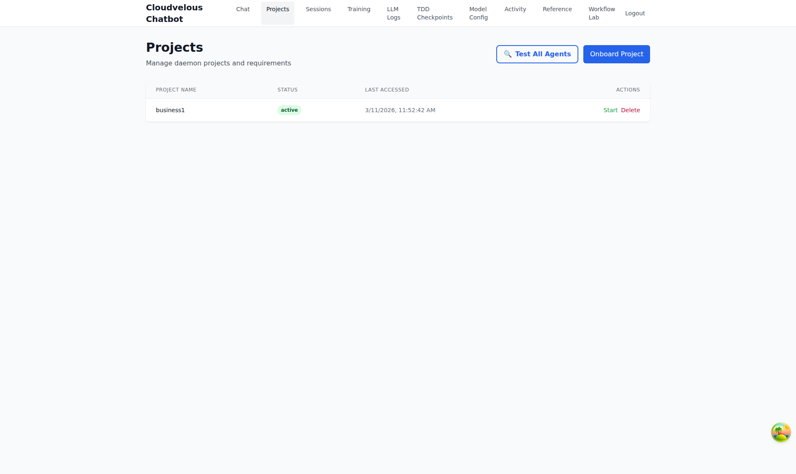
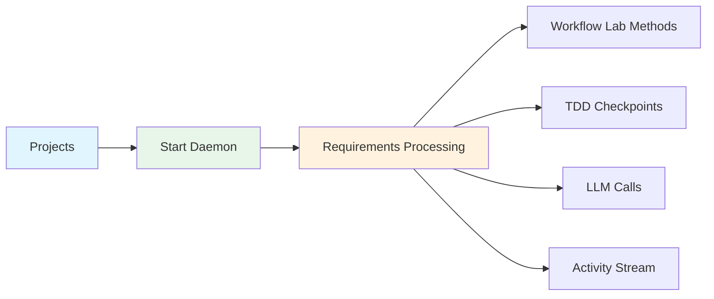

# 01 - Projects

> **Manage daemon projects and requirements**

---

## Screenshot



## Overview

The Projects page is the central hub for managing daemon projects and their associated requirements. This is where you onboard new projects, control the daemon lifecycle, and monitor project status.

---

## Purpose

The Projects module serves as:
- **Project Registry** - Centralized list of all daemon-managed projects
- **Daemon Control Center** - Start, stop, and pause project processing
- **Requirement Management** - Track project requirements and their status
- **Entry Point** - The starting point for all engineering workflow activities

---

## Key Features

| Feature | Description | Benefit |
|---------|-------------|---------|
| Project Onboarding | Add new projects to the daemon | Quick project setup |
| Daemon Control | Start/Stop/Pause project processing | Full operational control |
| Status Monitoring | View project status (active/inactive) | At-a-glance health checks |
| Agent Testing | Test all configured agents | Validate connectivity |
| Last Accessed | Track when projects were last active | Usage analytics |

---

## UI Elements

### Header Actions

```
┌─────────────────────────────────────────────────────────────────┐
│ Projects                                    [Test All Agents]  │
│ Manage daemon projects and requirements    [Onboard Project]   │
└─────────────────────────────────────────────────────────────────┘
```

- **Test All Agents** - Validates connectivity with all configured LLM agents
- **Onboard Project** - Wizard to add a new project to the daemon

### Project List

| Column | Description |
|--------|-------------|
| Project Name | Unique project identifier |
| Status | Current state (active/inactive, daemon running) |
| Last Accessed | Timestamp of last activity |
| Actions | Start/Stop/Pause/Delete controls |

### Action Buttons (Per Project)

| Button | State | Action |
|--------|-------|--------|
| Start | When stopped | Begins daemon processing for the project |
| Pause | When running | Temporarily halts processing |
| Stop | When running | Completely stops daemon processing |
| Delete | Always | Removes project from the system |

---

## Usage Instructions

### Onboarding a New Project

1. Click the **"Onboard Project"** button
2. Follow the onboarding wizard to:
   - Set project name and identifier
   - Configure requirement sources
   - Set up initial parameters
3. The project appears in the project list

### Starting a Project

1. Locate the project in the list
2. Click the **"Start"** button in the Actions column
3. Status changes to "active" with "Daemon Running" badge
4. The daemon begins processing requirements automatically

### Stopping a Project

1. Find a running project (shows "Daemon Running")
2. Click **"Stop"** to halt all processing
3. Status reverts to "active" only
4. All workflows are paused until restarted

### Pausing a Project

1. Click **"Pause"** on a running project
2. Processing temporarily halts but can be resumed
3. Useful for temporary intervention without full restart

---

## Workflow Integration



---

## Benefits

### For Project Managers
- **Centralized Control** - Single pane of glass for all projects
- **Operational Visibility** - Clear status indicators for all projects
- **Quick Actions** - Immediate start/stop without complex procedures

### For Engineers
- **Requirement Intake** - Projects feed requirements into the workflow
- **Daemon Management** - Control processing without code changes
- **Agent Validation** - Test connectivity before starting work

### For DevOps
- **Lifecycle Management** - Full control over daemon processes
- **Resource Control** - Stop processing to free up resources
- **Audit Trail** - Last accessed tracking for usage patterns

---

## Best Practices

1. **Always Test Agents First** - Click "Test All Agents" before starting a project
2. **Monitor Before Starting** - Check Activity Stream to ensure system is ready
3. **Pause Before Major Changes** - Pause rather than stop for temporary interventions
4. **Regular Status Checks** - Review project status as part of daily workflow

---

## Related Pages

- **[02 - LLM Logs](./02-llm-logs.md)** - Monitor agent calls initiated by projects
- **[03 - TDD Checkpoints](./03-tdd-checkpoints.md)** - Review checkpoints for running projects
- **[05 - Activity](./05-activity.md)** - Watch real-time project activity
- **[07 - Workflow Lab](./07-workflow-lab.md)** - Debug methods used by projects

---

## URL

```
/admin/projects
```

---

*Part of the Cloudvelous Engineering Workflow Documentation*
