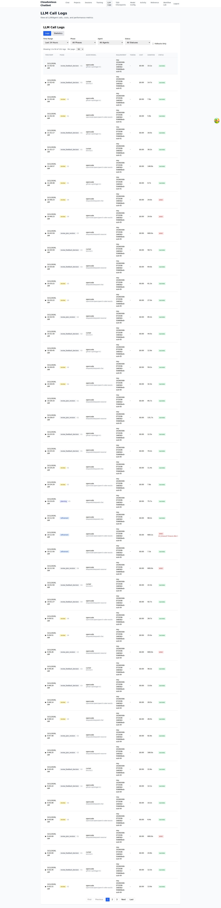
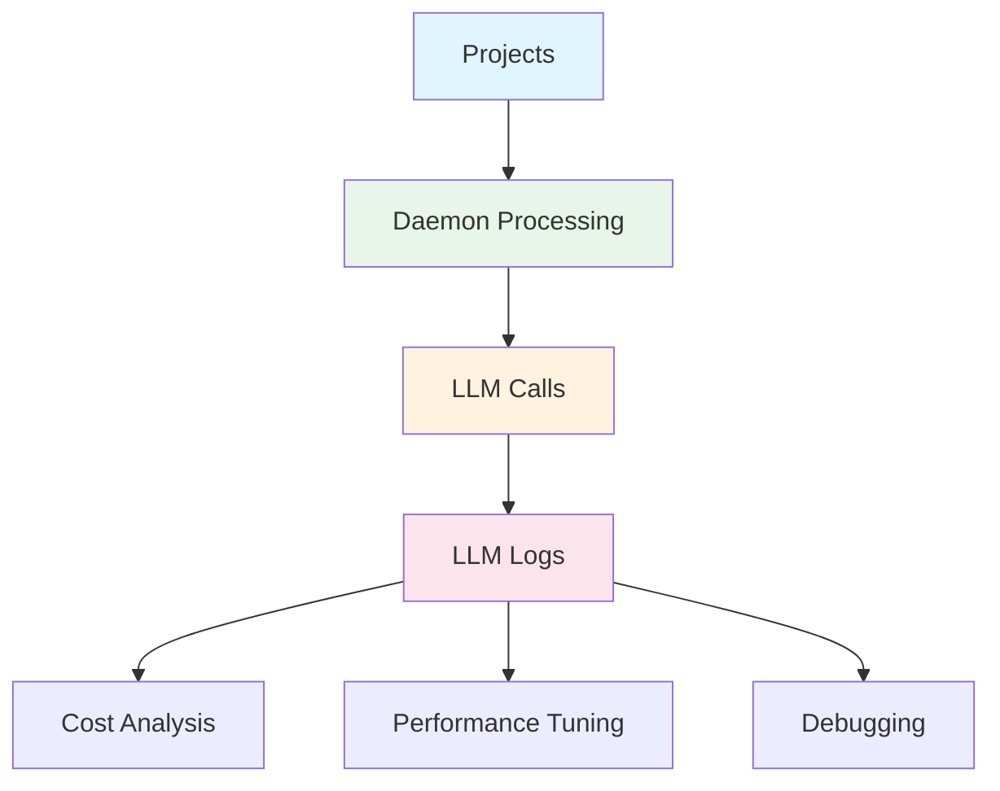

# 02 - LLM Logs

> **View all LLM/Agent calls, costs, and performance metrics**

---

## Screenshot



## Overview

The LLM Logs page provides comprehensive tracking and analytics for all AI agent interactions. Monitor every LLM call across your projects with detailed metrics on tokens, costs, duration, and status.

---

## Purpose

The LLM Logs module serves as:
- **Cost Monitoring** - Track spending across different agents and projects
- **Performance Analytics** - Analyze call duration and success rates
- **Debugging Tool** - Investigate failed or slow LLM calls
- **Audit Trail** - Complete history of all AI interactions

---

## Key Features

| Feature | Description | Benefit |
|---------|-------------|---------|
| Time Range Filter | Filter by last hour, 24 hours, week, or month | Focused analysis |
| Phase Filtering | Filter by workflow phase (refinement, decomposition, planning, review, finalization) | Phase-specific debugging |
| Agent Filtering | Filter by specific LLM agent | Agent performance comparison |
| Status Filtering | Filter by success, error, or timeout | Error investigation |
| Fallbacks Only | Show only fallback agent calls | Cost optimization analysis |
| Pagination | View 25, 50, 100, or 200 logs per page | Performance handling |

---

## UI Elements

### Filter Bar

```
┌──────────────────────────────────────────────────────────────────────────────┐
│ [Last 24 Hours] [All Phases] [All Agents] [All Statuses] [☐ Fallbacks Only] │
│                                                                          50  │
└──────────────────────────────────────────────────────────────────────────────┘
```

### Log Table

| Column | Description | Example |
|--------|-------------|---------|
| Timestamp | When the call occurred | 3/11/2026, 7:04:23 AM |
| Phase | Workflow phase | review, refinement, planning |
| Agent/Model | LLM agent and model | cursor kimi-k2.5, opencode gpt-4.1 |
| Requirement | Associated requirement ID | req-20260308-... |
| Tokens | Input/output token count | - (or numeric) |
| Cost | Calculated cost | $0.00 |
| Duration | Call duration | 48.8s, 143.2s |
| Status | Success/failure indicator | success (green badge) |

### Tabs

- **Logs** - Individual call details
- **Statistics** - Aggregated analytics (if available)

---

## Supported Phases

| Phase | Description |
|-------|-------------|
| Refinement | Requirement polishing and clarification |
| Decomposition | Breaking down requirements into chunks |
| Planning | Strategy and approach development |
| Review | Code and output review cycles |
| Finalization | Completion and cleanup |

## Supported Agents

| Agent | Models |
|-------|--------|
| DeepSeek | DeepSeek API models |
| OpenCode | github-copilot/gpt-4.1, openrouter/qwen |
| Cursor | kimi-k2.5 |
| Claude | Anthropic Claude models |

---

## Usage Instructions

### Analyzing Costs

1. Select **"Last Month"** from Time Range dropdown
2. Review the Cost column for each call
3. Identify high-cost calls by sorting/filtering
4. Use for budget planning and optimization

### Debugging Failures

1. Set Status filter to **"Error"** or **"Timeout"**
2. Review failed calls in the timestamp range
3. Click on individual logs to view details
4. Correlate with Activity Stream events

### Comparing Agent Performance

1. Filter by a specific **Agent** (e.g., "Cursor")
2. Note average Duration for that agent
3. Switch to another agent and compare
4. Use data to optimize agent selection

### Phase-Specific Analysis

1. Select a specific **Phase** from dropdown
2. Review all calls in that phase
3. Identify bottlenecks or high-frequency phases
4. Optimize workflow based on data

---

## Workflow Integration



---

## Benefits

### For Finance/Budgeting
- **Cost Tracking** - See exact spend per agent and project
- **Budget Planning** - Historical data for forecasting
- **ROI Analysis** - Compare cost vs. productivity gains

### For Engineering
- **Performance Debugging** - Identify slow or failing calls
- **Agent Optimization** - Choose fastest/cheapest agents per task
- **Error Investigation** - Trace issues to specific calls

### For DevOps
- **System Health** - Monitor call patterns and anomalies
- **Capacity Planning** - Token usage trends for scaling
- **Audit Compliance** - Complete record of AI usage

---

## Best Practices

1. **Daily Cost Check** - Review costs at least once per day for running projects
2. **Error Monitoring** - Filter by errors weekly to catch systemic issues
3. **Agent Comparison** - Regularly compare agent performance for optimization
4. **Fallback Analysis** - Use "Fallbacks Only" to identify reliability issues

---

## Related Pages

- **[01 - Projects](./01-projects.md)** - Projects generate the LLM calls logged here
- **[05 - Activity](./05-activity.md)** - Real-time companion to historical logs
- **[04 - Model Config](./04-model-config.md)** - Configure the agents shown in logs

---

## URL

```
/admin/llm-logs
```

---

*Part of the Cloudvelous Engineering Workflow Documentation*
