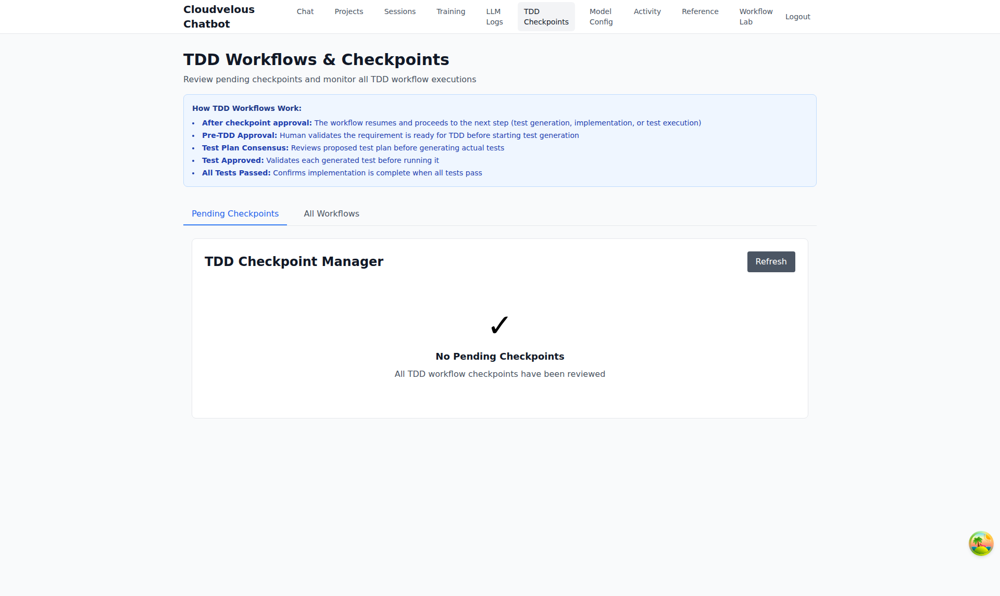
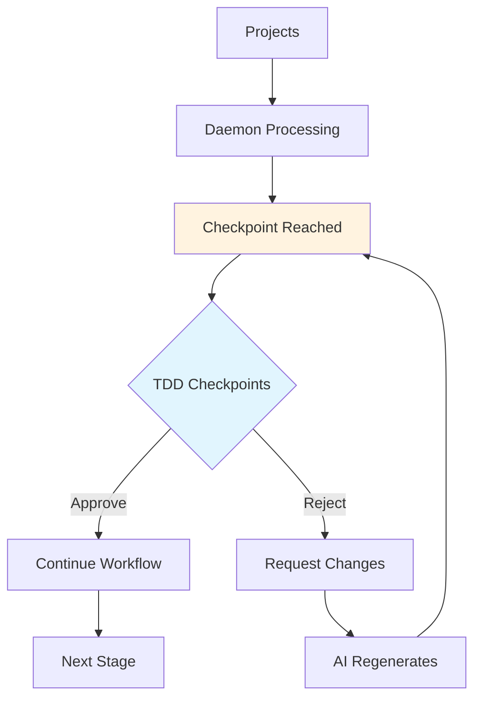

# 03 - TDD Checkpoints

> **Review pending checkpoints and monitor all TDD workflow executions**

---

## Screenshot



## Overview

The TDD Checkpoints page provides human-in-the-loop oversight for Test-Driven Development workflows. Review and approve critical stages before the AI agents proceed with implementation.

---

## Purpose

The TDD Checkpoints module serves as:
- **Quality Gate** - Human approval required at critical workflow stages
- **Workflow Monitor** - Track all TDD workflow executions
- **Decision Point** - Approve or reject AI-generated plans and tests
- **Safety Control** - Prevent incorrect implementations before they occur

---

## Key Features

| Feature | Description | Benefit |
|---------|-------------|---------|
| Pending Checkpoints | Queue of items awaiting approval | Centralized review queue |
| All Workflows View | Complete history of workflows | Full audit trail |
| Auto-refresh | Automatic updates of checkpoint status | Real-time awareness |
| Approval Actions | Approve/Reject with feedback | Controlled progression |
| Checkpoint Types | Different stages require different approvals | Stage-appropriate oversight |

---

## UI Elements

### Tabs

```
┌─────────────────────────────────────────────────────────────┐
│ [Pending Checkpoints]  [All Workflows]                    │
└─────────────────────────────────────────────────────────────┘
```

- **Pending Checkpoints** - Items awaiting your review
- **All Workflows** - Complete history including completed workflows

### How TDD Workflows Work (Info Box)

```
┌─────────────────────────────────────────────────────────────┐
│ How TDD Workflows Work:                                     │
│ • After checkpoint approval: The workflow resumes and         │
│   proceeds to the next step (test generation,                 │
│   implementation, or test execution)                         │
│ • Pre-TDD Approval: Human validates the requirement is       │
│   ready for TDD before starting test generation              │
│ • Test Plan Consensus: Reviews proposed test plan before     │
│   generating actual tests                                    │
│ • Test Approved: Validates each generated test before        │
│   running it                                               │
│ • All Tests Passed: Confirms implementation is complete      │
│   when all tests pass                                      │
└─────────────────────────────────────────────────────────────┘
```

### Checkpoint Manager

| Element | Description |
|---------|-------------|
| Refresh Button | Manually refresh checkpoint status |
| Empty State | "No Pending Checkpoints" with checkmark icon |
| Checkmark Icon | Visual confirmation all items reviewed |

---

## Checkpoint Types

### 1. Pre-TDD Approval

| Aspect | Details |
|--------|---------|
| Purpose | Validate requirement is ready for TDD |
| Trigger | Before test generation begins |
| Action | Approve to start test generation |
| Rejection | Returns requirement for refinement |

### 2. Test Plan Consensus

| Aspect | Details |
|--------|---------|
| Purpose | Review proposed test plan |
| Trigger | After AI generates test plan |
| Action | Approve to generate actual tests |
| Rejection | Request plan modifications |

### 3. Test Approved

| Aspect | Details |
|--------|---------|
| Purpose | Validate each generated test |
| Trigger | After individual test generation |
| Action | Approve to include test in suite |
| Rejection | Request test corrections |

### 4. All Tests Passed

| Aspect | Details |
|--------|---------|
| Purpose | Confirm implementation complete |
| Trigger | After all tests execute |
| Action | Approve to finalize requirement |
| Rejection | Return for further implementation |

---

## Usage Instructions

### Reviewing Pending Checkpoints

1. Navigate to the **"Pending Checkpoints"** tab
2. Review each checkpoint in the queue
3. For each checkpoint:
   - Read the AI-generated content (plan, test, etc.)
   - Decide to **Approve** or **Request Changes**
4. After approval, workflow automatically resumes

### Viewing All Workflows

1. Switch to **"All Workflows"** tab
2. See complete history of TDD executions
3. Filter or search for specific workflows
4. Review outcomes and approval history

### Understanding the Flow

```
Requirement Intake
       ↓
[Pre-TDD Approval Checkpoint] ← YOU ARE HERE
       ↓
Test Plan Generation
       ↓
[Test Plan Consensus Checkpoint] ← YOU ARE HERE
       ↓
Individual Test Generation
       ↓
[Test Approved Checkpoint] ← YOU ARE HERE (for each test)
       ↓
Test Execution
       ↓
[All Tests Passed Checkpoint] ← YOU ARE HERE
       ↓
Implementation Complete
```

---

## Workflow Integration



---

## Benefits

### For Engineering Teams
- **Quality Assurance** - Human eyes on AI output before implementation
- **Correctness Validation** - Catch errors before they become bugs
- **Standards Compliance** - Ensure outputs meet team standards
- **Knowledge Transfer** - Review AI approaches for learning

### For Project Managers
- **Controlled Automation** - AI handles execution, humans handle decisions
- **Risk Mitigation** - Approval gates prevent costly mistakes
- **Progress Visibility** - Clear view of what's pending and why
- **Team Confidence** - Stakeholders trust the human oversight

### For Tech Leads
- **Architectural Alignment** - Ensure AI outputs match technical vision
- **Code Review Early** - Catch issues before code is written
- **Standards Enforcement** - Maintain coding standards across AI-generated code

---

## Best Practices

1. **Daily Checkpoint Review** - Check pending checkpoints at least once daily
2. **Quick Turnaround** - Approve/reject promptly to avoid workflow delays
3. **Constructive Feedback** - Provide clear reasons for rejections
4. **Pattern Recognition** - Watch for recurring issues in AI output
5. **Batch Reviews** - Group similar checkpoints for efficient processing

---

## Related Pages

- **[01 - Projects](./01-projects.md)** - Projects generate checkpoints during processing
- **[05 - Activity](./05-activity.md)** - Watch real-time checkpoint status
- **[07 - Workflow Lab](./07-workflow-lab.md)** - Test TDD-related pipeline methods

---

## URL

```
/admin/tdd/checkpoints
```

---

*Part of the Cloudvelous Engineering Workflow Documentation*
