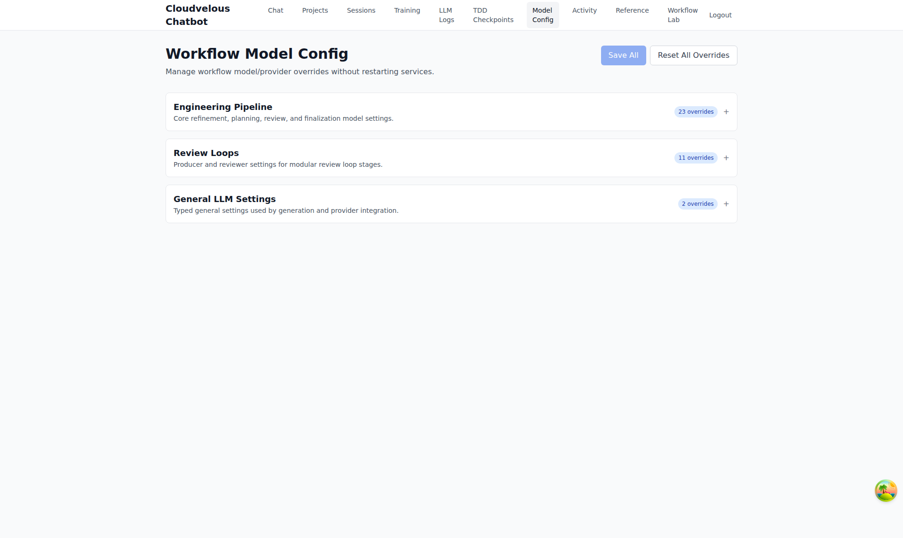
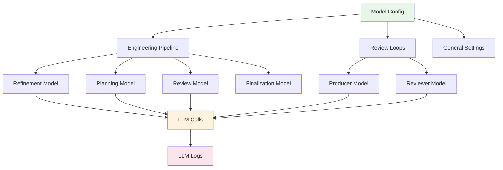

# 04 - Model Config

> **Manage workflow model/provider overrides without restarting services**

---

## Screenshot



## Overview

The Workflow Model Config page provides a centralized interface for viewing LLM model configurations and provider settings. This is a **view-only** documentation of the configuration - settings are managed through other channels.

---

## Purpose

The Model Config module serves as:
- **Configuration Registry** - Centralized view of all model overrides
- **Provider Management** - Multiple LLM provider configurations
- **Model Mapping** - Which models are used for which workflow phases
- **Settings Documentation** - Reference for current configuration

---

## Key Features

| Feature | Description | Count |
|---------|-------------|-------|
| Engineering Pipeline | Core workflow phase settings | 23 overrides |
| Review Loops | Producer/reviewer configurations | 11 overrides |
| General LLM Settings | Global integration settings | 2 overrides |
| Save All | Persist changes (when editing enabled) | - |
| Reset All Overrides | Revert to defaults (when editing enabled) | - |

---

## UI Elements

### Header Actions

```
┌─────────────────────────────────────────────────────────────────┐
│ Workflow Model Config                    [Save All] [Reset]  │
│ Manage workflow model/provider overrides                        │
└─────────────────────────────────────────────────────────────────┘
```

### Configuration Sections

| Section | Description | Overrides |
|---------|-------------|-----------|
| **Engineering Pipeline** | Core refinement, planning, review, and finalization model settings | 23 |
| **Review Loops** | Producer and reviewer settings for modular review loop stages | 11 |
| **General LLM Settings** | Typed general settings used by generation and provider integration | 2 |

---

## Configuration Categories

### Engineering Pipeline (23 Overrides)

Core settings for the main engineering workflow phases:

| Phase | Settings Include |
|-------|------------------|
| Refinement | Model selection for requirement polishing |
| Planning | Strategy and approach generation models |
| Review | Code review and feedback models |
| Finalization | Completion and cleanup models |

**Purpose**: Configure which LLM handles each major workflow phase

### Review Loops (11 Overrides)

Settings for the iterative review process:

| Role | Settings Include |
|------|------------------|
| Producer | Model that generates code/content |
| Reviewer | Model that reviews and provides feedback |

**Purpose**: Set up specialized models for the producer-reviewer pattern

### General LLM Settings (2 Overrides)

Global configuration affecting all LLM interactions:

| Setting | Purpose |
|---------|---------|
| Provider Integration | API keys, endpoints, timeouts |
| Generation Parameters | Temperature, max tokens, etc. |

**Purpose**: Global defaults and provider connectivity

---

## Supported Models & Providers

### LLM Providers

| Provider | Models Available |
|----------|------------------|
| DeepSeek | DeepSeek Chat, DeepSeek Coder |
| OpenAI | GPT-4, GPT-4.1, GPT-3.5 |
| Anthropic | Claude 3 Opus, Sonnet, Haiku |
| Moonshot AI | Kimi k1.5, k2.5 |
| GitHub Copilot | Copilot Chat models |
| OpenRouter | Various aggregated models |

### Model Selection Strategy

| Task Type | Recommended Model Characteristic |
|-----------|----------------------------------|
| Code Generation | Strong coding models (GPT-4, Claude) |
| Code Review | Detail-oriented models (Kimi, Claude) |
| Planning | Reasoning-focused models (DeepSeek, GPT-4) |
| Refinement | Context-aware models (Claude, Kimi) |

---

## Usage Instructions

### Viewing Current Configuration

1. Navigate to the **Model Config** page
2. Review the three main sections
3. Expand sections by clicking the `+` button
4. View specific model assignments per phase

### Understanding Overrides

An "override" means a specific model has been assigned to a specific task, overriding the default. For example:
- Default: All phases use GPT-4
- Override: Planning phase uses DeepSeek
- Override: Review phase uses Kimi

### Configuration Persistence

- Changes take effect **without service restart**
- New workflows immediately use updated models
- Running workflows continue with previous settings

---

## Workflow Integration



---

## Benefits

### For Engineering Teams
- **Model Flexibility** - Use best model for each task type
- **Cost Optimization** - Cheaper models for simple tasks
- **Quality Tuning** - Premium models for critical phases
- **No Downtime** - Changes apply immediately

### For DevOps
- **Provider Redundancy** - Multiple providers for reliability
- **Rate Limit Management** - Distribute load across providers
- **Configuration Visibility** - Clear view of all model assignments

### For Management
- **Cost Control** - Track which models are used where
- **Performance Tuning** - Optimize model selection for ROI

---

## Best Practices

1. **Document Overrides** - Keep notes on why specific models were chosen
2. **Test Changes** - Verify new model works well for its assigned task
3. **Monitor Costs** - Use LLM Logs to track cost per model
4. **Fallback Strategy** - Configure backup models for reliability

---

## Important Notes

- **View Only**: This documentation reflects current settings
- **No Direct Editing**: Configuration changes are managed separately
- **Immediate Effect**: Changes apply to new workflows instantly
- **Audit Trail**: Model changes are logged for review

---

## Related Pages

- **[02 - LLM Logs](./02-llm-logs.md)** - See which models are actually being used
- **[07 - Workflow Lab](./07-workflow-lab.md)** - Test different models for specific tasks
- **[01 - Projects](./01-projects.md)** - Projects use the configured models

---

## URL

```
/admin/workflow-config
```

---

*Part of the Cloudvelous Engineering Workflow Documentation*
*Note: This page is view-only. Model configuration changes are managed separately.*
