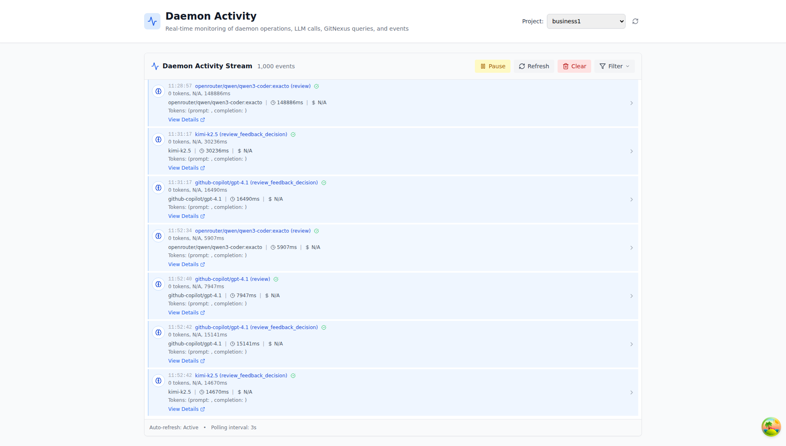
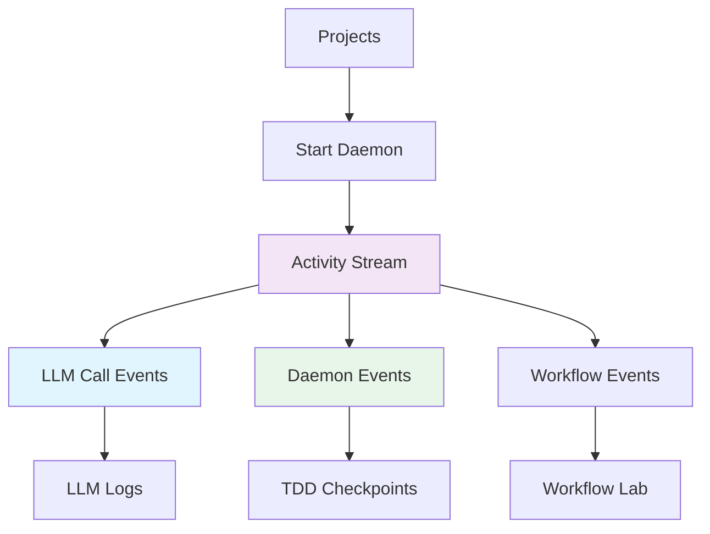

# 05 - Activity

> **Real-time monitoring of daemon operations, LLM calls, GitNexus queries, and events**

---

## Screenshot



## Overview

The Daemon Activity page provides a live streaming view of all system operations. Watch in real-time as the daemon processes requirements, makes LLM calls, and executes workflow steps.

---

## Purpose

The Activity module serves as:
- **Live Operations Center** - Real-time view of daemon activity
- **Debugging Console** - See exactly what's happening right now
- **System Health Monitor** - Visual indicator of system status
- **Event History** - Scrollable history of recent operations

---

## Key Features

| Feature | Description | Benefit |
|---------|-------------|---------|
| Project Selector | Filter activity by specific project | Focused monitoring |
| Pause/Resume | Freeze the stream for analysis | Detailed review |
| Refresh | Manually update the stream | On-demand sync |
| Clear | Remove all events | Clean slate |
| Filter | Show only specific event types | Noise reduction |
| Auto-refresh | 3-second polling interval | Near real-time updates |
| Event Count | Shows total events in stream | Activity volume |

---

## UI Elements

### Header Controls

```
┌──────────────────────────────────────────────────────────────────────┐
│  Daemon Activity                          Project: [business1 ▼]   │
│  Real-time monitoring of daemon operations                           │
└──────────────────────────────────────────────────────────────────────┘
```

### Activity Stream Controls

```
┌──────────────────────────────────────────────────────────────────────┐
│  Daemon Activity Stream  1,000 events      [Pause] [Refresh] [Clear] │
│                                          [Filter ▼]                │
└──────────────────────────────────────────────────────────────────────┘
```

### Event Types

The stream shows different event types with color coding:

| Event Type | Color | Description |
|------------|-------|-------------|
| LLM Calls | Blue | Agent API calls (github-copilot, kimi, opencode) |
| Daemon Events | Green | System lifecycle events |
| Workflow Steps | Teal | Individual workflow phase transitions |
| Errors | Red | Failed operations (if any) |

---

## Event Details

### LLM Call Events

```
┌────────────────────────────────────────────────────────────────────────────┐
│ 🤖 06:56:40  github-copilot/gpt-4.1 (review)                              │
│    0 tokens, N/A, 11917ms                                                  │
│    github-copilot/gpt-4.1 | 11917ms | $ N/A                               │
│    Tokens: (prompt: , completion: )                                        │
│    [View Details ↗]                                                        │
└────────────────────────────────────────────────────────────────────────────┘
```

**Fields:**
- **Timestamp** - When the call was made
- **Agent/Model** - Which LLM was invoked
- **Phase** - Workflow phase (review, refinement, etc.)
- **Tokens** - Input/output token counts
- **Duration** - How long the call took (ms)
- **Cost** - Estimated cost of the call

### Daemon Events

```
┌────────────────────────────────────────────────────────────────────────────┐
│ ⚙️ 06:55:27  daemon:tick_start                                            │
│    Coordinator tick started                                                │
│    Starting planning workflow for req-...                                │
└────────────────────────────────────────────────────────────────────────────┘
```

**Common Daemon Events:**
- `daemon:tick_start` - Coordinator begins a processing cycle
- `daemon:planning_start` - Planning phase initiated
- `daemon:workflow_step_start` - Individual step execution begins

### Workflow Step Events

```
┌────────────────────────────────────────────────────────────────────────────┐
│ 🔄 06:55:27  daemon:workflow_step_start                                   │
│    Starting refinement for req-20260308-...                                │
└────────────────────────────────────────────────────────────────────────────┘
```

---

## Usage Instructions

### Monitoring Active Projects

1. Select the project from the **Project** dropdown
2. Watch the stream for real-time updates
3. Click **"Pause"** to freeze for detailed review
4. Click **"Refresh"** to manually update
5. Click **"Clear"** to reset the stream

### Debugging Issues

1. Look for events with long durations (timeout indicators)
2. Watch for error events (if shown)
3. Click **"View Details"** on specific LLM calls
4. Correlate with LLM Logs for deeper analysis

### Analyzing Performance

1. Monitor the **polling interval** (3 seconds)
2. Watch event frequency to understand processing speed
3. Identify bottlenecks by phase (review, planning, etc.)
4. Use duration metrics to spot slow operations

---

## Workflow Integration



---

## Benefits

### For Engineering Teams
- **Live Debugging** - See problems as they happen
- **Progress Visibility** - Know exactly what the AI is doing
- **Performance Insight** - Watch durations in real-time
- **Transparency** - Full visibility into automated processes

### For Project Managers
- **Operational Awareness** - Know when workflows are active
- **Issue Detection** - Spot delays or stuck processes
- **Resource Monitoring** - See processing intensity
- **Stakeholder Updates** - Provide accurate progress reports

### For DevOps
- **System Health** - Monitor daemon operation
- **Capacity Planning** - Observe event frequency patterns
- **Alert Integration** - Use for monitoring dashboards
- **Incident Response** - Rapid issue identification

---

## Best Practices

1. **Keep Open During Active Work** - Monitor while projects are running
2. **Pause for Analysis** - Use pause button when investigating
3. **Correlate with Logs** - Cross-reference with LLM Logs for details
4. **Filter by Project** - Focus on one project at a time
5. **Watch for Patterns** - Learn normal vs. abnormal activity patterns

---

## Status Indicators

| Indicator | Meaning | Action |
|-----------|---------|--------|
| Auto-refresh: Active | Stream is updating | None needed |
| Polling interval: 3s | Normal update frequency | Standard monitoring |
| Event count growing | Processing is active | Continue monitoring |
| Static event count | Processing paused/complete | Check project status |

---

## Related Pages

- **[02 - LLM Logs](./02-llm-logs.md)** - Historical companion to real-time activity
- **[01 - Projects](./01-projects.md)** - Control which projects appear in activity
- **[07 - Workflow Lab](./07-workflow-lab.md)** - Manually trigger events you see here

---

## URL

```
/admin/daemon-activity
```

---

*Part of the Cloudvelous Engineering Workflow Documentation*
