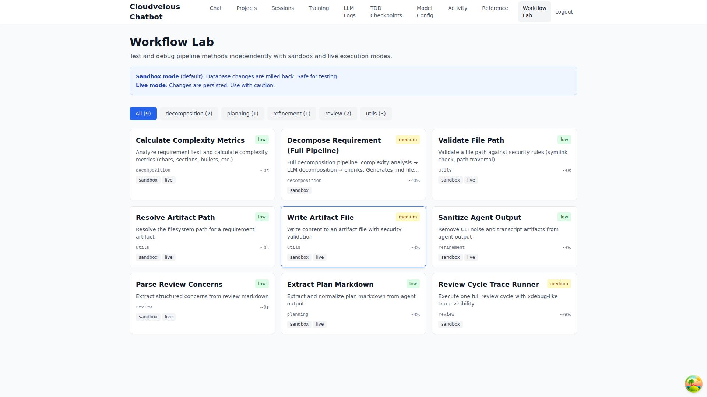
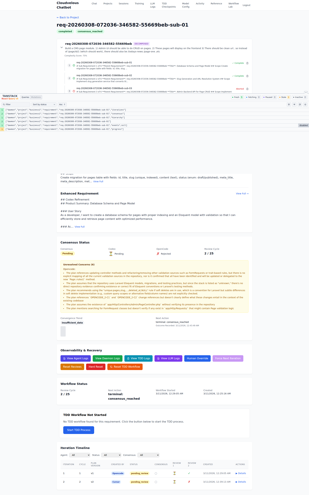
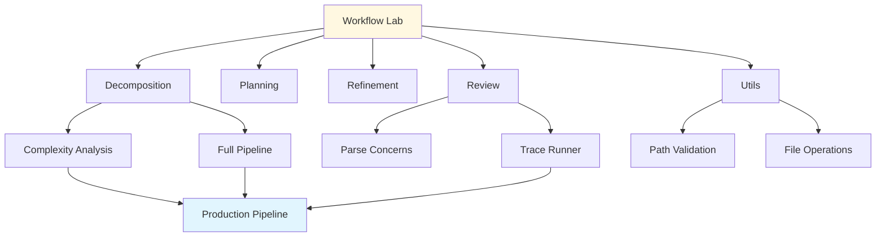

# 07 - Workflow Lab

> **Test and debug pipeline methods independently with sandbox and live execution modes**

---

## Screenshot



## Overview

The Workflow Lab is a testing and debugging environment for the engineering pipeline. Execute individual workflow methods in isolation to understand their behavior, debug issues, or validate configurations.

---

## Purpose

The Workflow Lab serves as:
- **Testing Environment** - Try pipeline methods without affecting production
- **Debugging Tool** - Investigate method behavior with specific inputs
- **Learning Platform** - Understand what each method does
- **Validation Suite** - Verify methods work before live deployment

---

## Key Features

| Feature | Description | Benefit |
|---------|-------------|---------|
| Sandbox Mode | Database changes rolled back | Safe experimentation |
| Live Mode | Changes persisted | Production testing |
| Category Filtering | Filter by phase (decomposition, planning, etc.) | Focused exploration |
| Risk Indicators | Low/medium/high risk badges | Safety awareness |
| Duration Estimates | Estimated execution time | Planning aid |

### Tanstack Query Devtools

The Workflow Lab includes Tanstack Query Devtools for debugging API calls:



**Features:**
- Query/Mutation tabs
- Status filters (Fresh, Fetching, Stale, Paused, Inactive)
- Query cache inspection
- Offline behavior mocking
- Picture-in-picture mode

---

## Execution Modes

### Sandbox Mode (Default)

```
┌─────────────────────────────────────────────────────────────────────────────┐
│ ℹ️ Sandbox mode (default): Database changes are rolled back. Safe for     │
│    testing.                                                                 │
│ ⚠️ Live mode: Changes are persisted. Use with caution.                    │
└─────────────────────────────────────────────────────────────────────────────┘
```

| Aspect | Behavior |
|--------|----------|
| Database Changes | Automatically rolled back after execution |
| File System | Changes may still persist (method-dependent) |
| Safety | Completely safe for experimentation |
| Use Case | Testing, debugging, learning |

### Live Mode

| Aspect | Behavior |
|--------|----------|
| Database Changes | Permanently persisted |
| File System | Changes persist |
| Safety | Use with caution - affects production |
| Use Case | Intentional production changes |

---

## Method Categories

### Decomposition (2 Methods)

Breaking down requirements into manageable chunks:

| Method | Risk | Duration | Description |
|--------|------|----------|-------------|
| **Calculate Complexity Metrics** | Low | ~0s | Analyze requirement text and calculate complexity metrics (chars, sections, bullets, etc.) |
| **Decompose Requirement (Full Pipeline)** | Medium | ~30s | Full decomposition pipeline: complexity analysis → LLM decomposition → chunks. Generates .md files for each chunk in output directory. |

**When to Use:**
- Breaking large requirements into smaller pieces
- Analyzing requirement complexity
- Generating chunked output files

### Planning (1 Method)

Strategy and approach development:

| Method | Risk | Duration | Description |
|--------|------|----------|-------------|
| **Extract Plan Markdown** | Low | ~0s | Extract and normalize plan markdown from agent output |

**When to Use:**
- Parsing planning output from agents
- Normalizing plan formats
- Extracting structured plans from LLM responses

### Refinement (1 Method)

Polishing and improving outputs:

| Method | Risk | Duration | Description |
|--------|------|----------|-------------|
| **Sanitize Agent Output** | Low | ~0s | Remove CLI noise and transcript artifacts from agent output |

**When to Use:**
- Cleaning up agent responses
- Removing transcript markers
- Preparing output for further processing

### Review (2 Methods)

Code review and feedback:

| Method | Risk | Duration | Modes | Description |
|--------|------|----------|-------|-------------|
| **Parse Review Concerns** | Low | ~0s | sandbox, live | Extract structured concerns from review markdown |
| **Review Cycle Trace Runner** | Medium | ~60s | sandbox | Execute one full review cycle with xdebug-like trace visibility |

**When to Use:**
- Extracting actionable items from reviews
- Running complete review cycles
- Debugging review workflows
- Understanding review iteration behavior

### Utils (3 Methods)

Utility functions for file and path operations:

| Method | Risk | Duration | Modes | Description |
|--------|------|----------|-------|-------------|
| **Validate File Path** | Low | ~0s | sandbox, live | Validate a file path against security rules (symlink check, path traversal) |
| **Resolve Artifact Path** | Low | ~0s | sandbox, live | Resolve the filesystem path for a requirement artifact |
| **Write Artifact File** | Medium | ~0s | sandbox, live | Write content to an artifact file with security validation |

**When to Use:**
- Validating paths before file operations
- Resolving artifact storage locations
- Writing files with security checks

---

## Method Detail Page

Each method has a dedicated execution page:

```
┌─────────────────────────────────────────────────────────────────────────────┐
│ Method Name                                    [medium risk]              │
│ method_identifier                                                           │
│ Description of what the method does                                       │
│                                                                             │
│ Phase: review                    Est. Duration: ~60s                      │
│ Supported Modes: sandbox                                                    │
│                                                                             │
│ ┌─────────────────────────────────────────────────────────────────────────┐ │
│ │ Inputs                                                                  │ │
│ │                                                                         │ │
│ │ Project Name *                                                          │ │
│ │ [Project containing the requirement to review                        ] │ │
│ │                                                                         │ │
│ │ Requirement ID *                                                        │ │
│ │ [Requirement to execute review cycle on                              ] │ │
│ │                                                                         │ │
│ │ [Additional method-specific inputs...]                                │ │
│ └─────────────────────────────────────────────────────────────────────────┘ │
│                                                                             │
│ ┌─────────────────────────────────────────────────────────────────────────┐ │
│ │ Execution                                                               │ │
│ │                                                                         │ │
│ │ Execution Mode                                                          │ │
│ │ [sandbox]                                                               │ │
│ │ Database changes will be rolled back. Safe for testing.               │ │
│ │                                                                         │ │
│ │ [Execute (sandbox)]                                                     │ │
│ └─────────────────────────────────────────────────────────────────────────┘ │
└─────────────────────────────────────────────────────────────────────────────┘
```

### Common Input Fields

| Field | Description | Required |
|-------|-------------|----------|
| Project Name | The project containing the target requirement | Yes |
| Requirement ID | Specific requirement to process | Yes |
| Start Mode | Which iteration to use (latest or specific) | Varies |
| Max Cycles | Number of review cycles to execute | Varies |
| Continue From Run ID | Resume from previous run | Optional |

---

## Usage Instructions

### Testing a Method (Sandbox)

1. Navigate to **Workflow Lab**
2. Click on the desired method card
3. Fill in the required input fields
4. Ensure **"sandbox"** mode is selected
5. Click **"Execute (sandbox)"**
6. Review the results
7. All database changes are automatically rolled back

### Running in Live Mode

1. Select **"live"** mode (if available for the method)
2. Read the warning: "Changes are persisted"
3. Click **"Execute (live)"**
4. Changes are permanent

### Understanding Results

| Result Type | Meaning |
|-------------|---------|
| Success | Method executed without errors |
| Error | Something went wrong (check logs) |
| Timeout | Execution took too long |
| Output | Method-specific return data |

---

## Workflow Integration



---

## Benefits

### For Engineers
- **Safe Experimentation** - Test without breaking production
- **Method Understanding** - Learn what each method actually does
- **Debugging** - Reproduce and fix issues in isolation
- **Development** - Test new method implementations

### For DevOps
- **Validation** - Verify methods before deployment
- **Troubleshooting** - Diagnose production issues
- **Performance Testing** - Measure method execution times
- **Configuration Testing** - Validate settings

### For QA
- **Regression Testing** - Verify methods still work
- **Integration Testing** - Test method interactions
- **Edge Case Testing** - Try unusual inputs

---

## Best Practices

1. **Always Start in Sandbox** - Use sandbox mode first
2. **Review Method Description** - Understand what it does before executing
3. **Check Risk Level** - High-risk methods need extra caution
4. **Use Real Project Data** - Test with actual project/requirement IDs
5. **Monitor Duration** - Long-running methods may need attention
6. **Validate Inputs** - Ensure required fields are filled correctly

---

## Risk Levels Explained

| Risk | Description | Precautions |
|------|-------------|-------------|
| **Low** | Read-only or minimal changes | Generally safe even in live mode |
| **Medium** | Writes files or database | Use sandbox first, review code |
| **High** | Significant changes possible | Extra caution, full code review |

---

## Related Pages

- **[04 - Model Config](./04-model-config.md)** - Models used by these methods
- **[05 - Activity](./05-activity.md)** - Watch methods execute in production
- **[02 - LLM Logs](./02-llm-logs.md)** - See LLM calls made by methods
- **[Workflow Methods Reference](./workflow-methods.md)** - Detailed method documentation

---

## URL

```
/admin/workflow-lab
```

---

*Part of the Cloudvelous Engineering Workflow Documentation*
