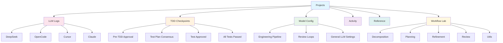

# Cloudvelous Engineering Workflow Documentation

> **AI-Powered Software Engineering Automation Platform**

[]()
[]()
[]()

Welcome to the **Cloudvelous Engineering Workflow** documentation. This guide provides comprehensive documentation for the engineering workflow platform that automates software development using multiple AI agents, Test-Driven Development (TDD), and intelligent orchestration.

---

## Overview

The Cloudvelous Engineering Workflow is an advanced automation platform designed to streamline the software development lifecycle through:

- **Multi-Agent AI Orchestration** - Leverages multiple LLM agents (DeepSeek, OpenCode, Cursor, Claude) for different phases
- **Test-Driven Development (TDD)** - Built-in TDD checkpoints with human-in-the-loop approval
- **Workflow Lab** - Sandbox and live testing environment for pipeline methods
- **Real-time Monitoring** - Live activity streams and LLM call logging
- **Intelligent Decomposition** - Automated requirement breakdown and planning

---

## Navigation

The admin interface follows this top navigation structure:

| # | Page | Description |
|---|------|-------------|
| 1 | [Projects](./01-projects.md) | Manage daemon projects and requirements |
| 2 | [LLM Logs](./02-llm-logs.md) | View AI agent calls, costs, and performance |
| 3 | [TDD Checkpoints](./03-tdd-checkpoints.md) | Review and approve TDD workflow stages |
| 4 | [Model Config](./04-model-config.md) | Configure LLM models and providers (View Only) |
| 5 | [Activity](./05-activity.md) | Real-time daemon operation monitoring |
| 6 | [Reference](./06-reference.md) | Reference materials and documentation |
| 7 | [Workflow Lab](./07-workflow-lab.md) | Test and debug pipeline methods |

### Additional Resources

| Page | Description |
|------|-------------|
| [API Docs](./09-api-docs.md) | Backend API documentation at `/docs` |

### Drill-Down Pages

| Page | Description |
|------|-------------|
| [Requirement Detail](./08-requirement-detail.md) | Deep view into requirements with iteration timeline and feedback decisions |

---

## Architecture



---

## Core Components

| Component | Purpose | Key Features |
|-----------|---------|--------------|
| [Projects](./01-projects.md) | Project management | Onboard, start/stop daemon, manage requirements |
| [LLM Logs](./02-llm-logs.md) | Cost & performance | Track calls, tokens, duration, costs |
| [TDD Checkpoints](./03-tdd-checkpoints.md) | Human oversight | 4 approval checkpoints in TDD workflow |
| [Model Config](./04-model-config.md) | Configuration | 36 model/provider overrides across 3 categories |
| [Activity](./05-activity.md) | Real-time ops | Live daemon monitoring, event streaming |
| [Reference](./06-reference.md) | Documentation | Reference materials and guides |
| [Workflow Lab](./07-workflow-lab.md) | Pipeline testing | 9 pipeline methods across 5 categories |
| [Requirement Detail](./08-requirement-detail.md) | Deep analysis | Iteration timeline, feedback decisions, consensus |

---

## Workflow Phases

The engineering workflow follows a structured pipeline:

```
┌─────────────┐    ┌─────────────┐    ┌─────────────┐    ┌─────────────┐    ┌─────────────┐
│ Requirement │ -> │Decomposition│ -> │  Planning   │ -> │ Refinement  │ -> │   Review    │
│   Intake    │    │   & Chunk   │    │  & Strategy │    │  & Polish   │    │  & Approval │
└─────────────┘    └─────────────┘    └─────────────┘    └─────────────┘    └─────────────┘
       │                  │                  │                  │                  │
       ▼                  ▼                  ▼                  ▼                  ▼
  [Projects]      [Workflow Lab]      [Workflow Lab]      [Workflow Lab]      [TDD Check]
  [Requirement                                    [TDD Checkpoints]
   Detail]
```

---

## Benefits

### For Engineering Teams

- **Accelerated Development** - AI agents handle repetitive tasks while humans focus on decisions
- **Consistent Quality** - Automated TDD ensures comprehensive test coverage
- **Cost Visibility** - Track LLM usage and costs per project/requirement
- **Safe Experimentation** - Sandbox mode for testing without affecting production
- **Real-time Monitoring** - Watch daemon operations as they happen

### For Project Managers

- **Transparent Progress** - Real-time activity streams show exactly what's happening
- **Human Control Points** - TDD checkpoints ensure quality at critical stages
- **Multi-Agent Strategy** - Different agents for different tasks optimize cost/quality
- **Configurable Models** - Adjust model settings without service restarts

### For DevOps

- **Centralized Logging** - All LLM calls tracked with performance metrics
- **Daemon Management** - Start, stop, pause projects with full control
- **Provider Flexibility** - Multiple LLM providers with fallback support

---

## Supported Agents

| Agent | Provider | Best For |
|-------|----------|----------|
| DeepSeek | DeepSeek API | Complex reasoning tasks |
| OpenCode | GitHub Copilot/GPT-4.1 | Code generation and review |
| Cursor | Kimi-k2.5 | Context-aware development |
| Claude | Anthropic | Long-form content and analysis |

---

## Getting Started

### Prerequisites

- Access to Cloudvelous admin panel at `/admin`
- Project with configured requirements
- Understanding of TDD principles

### Basic Usage

1. **Onboard a Project**: Go to [Projects](./01-projects.md) and click "Onboard Project"
2. **Start the Daemon**: Click "Start" to begin automated processing
3. **Monitor LLM Usage**: Track costs and calls at [LLM Logs](./02-llm-logs.md)
4. **Review Checkpoints**: Approve TDD checkpoints at [TDD Checkpoints](./03-tdd-checkpoints.md)
5. **View Configuration**: Check model settings at [Model Config](./04-model-config.md)
6. **Watch Activity**: Monitor the [Activity Stream](./05-activity.md) for real-time updates
7. **Reference Docs**: Consult [Reference](./06-reference.md) for guides
8. **Test Methods**: Use [Workflow Lab](./07-workflow-lab.md) to debug pipeline methods

---

## Detailed Documentation

- **[01 - Projects](./01-projects.md)** - Project onboarding and daemon management
- **[02 - LLM Logs](./02-llm-logs.md)** - AI agent call tracking and cost analysis
- **[03 - TDD Checkpoints](./03-tdd-checkpoints.md)** - Human-in-the-loop approval workflow
- **[04 - Model Config](./04-model-config.md)** - LLM model and provider configuration (View Only)
- **[05 - Activity](./05-activity.md)** - Real-time daemon operation monitoring
- **[06 - Reference](./06-reference.md)** - Reference materials and documentation
- **[07 - Workflow Lab](./07-workflow-lab.md)** - Pipeline method testing and debugging
- **[08 - Requirement Detail](./08-requirement-detail.md)** - Deep requirement analysis with iteration timeline
- **[09 - API Docs](./09-api-docs.md)** - Backend API documentation (Swagger/OpenAPI)
- **[Workflow Methods Reference](./workflow-methods.md)** - Detailed method documentation

---

## Support

For questions or issues with the engineering workflow:

1. Check the detailed documentation pages
2. Review LLM Logs for error details
3. Monitor Activity Stream for real-time status
4. Use Workflow Lab to test methods in sandbox mode
5. Consult Reference materials for guides

---

*Documentation generated from Cloudvelous Admin Interface exploration*
